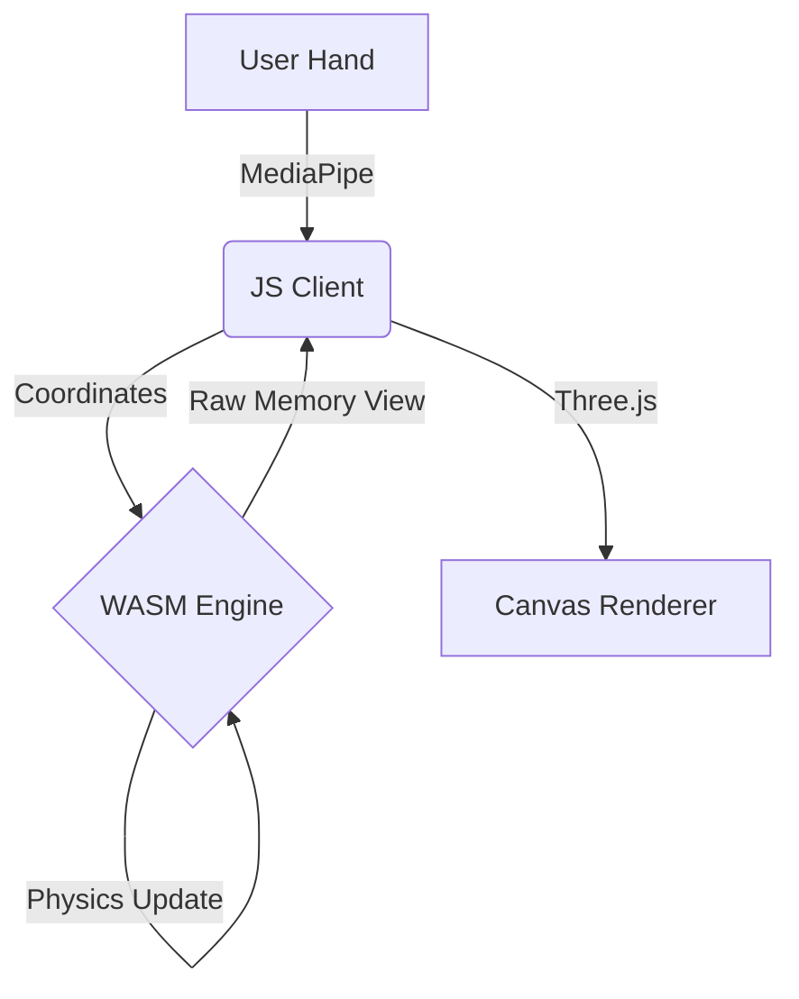

<<<<<<< HEAD
# Particle-Gravity-Fun
=======
# 🌌 Quantum Flux: Particle Gravity Engine

> **"Experience the beauty of math and physics in your browser."**

---

## 🌟 Support My Work!

**If you enjoy this project, please star the repository! It helps a lot!**  
👇👇👇  
**[github.com/yogender-ai/Particle-Gravity-Fun](https://github.com/yogender-ai/Particle-Gravity-Fun)**

---

## 🚀 Overview

**Quantum Flux** is a high-performance, interactive particle simulation powered by a **Rust-compiled WebAssembly core**. It features 8,000 particles responding to hand gestures in real-time.

### ✨ Key Features
*   **WASM-Powered Physics**: Core attraction and swarming logic runs in raw WebAssembly for maximum FPS.
*   **Hand Tracking**: Control the swarm with your **Index Finger** using MediaPipe.
*   **Gestures**: **Pinch** to trigger a cosmic color explosions.
*   **Shape Shifting**: Morph particles into Hearts, Planets, Flowers, and Fireworks.
*   **Security**: Heavily obfuscated client and opaque binary logic.

---

## 🎮 How to Play

1.  **Allow Camera Access**: The app needs to see your hand.
2.  **Point your Index Finger**: The swarm will orbit your fingertip.
3.  **Pinch (Index + Thumb)**: Watch the particles surge with energy and change color!
4.  **Use UI Buttons**: Switch between formation modes (Heart, Saturn, etc.).

---

## 🛠️ Architecture

*   **Engine**: Rust (`no_std`, `wasm32-unknown-unknown`)
*   **Renderer**: Three.js (WebGL)
*   **Input**: MediaPipe Hands

---

## 👤 Author

**Yogender**  
*   [LinkedIn](https://www.linkedin.com/in/yogender1/)
*   [GitHub](https://github.com/yogender-ai)

---

  <i>Created with ❤️ by Yogender-AI</i>

>>>>>>> 3ac0ed2 (Quantum Flux: Particle Gravity Engine)
