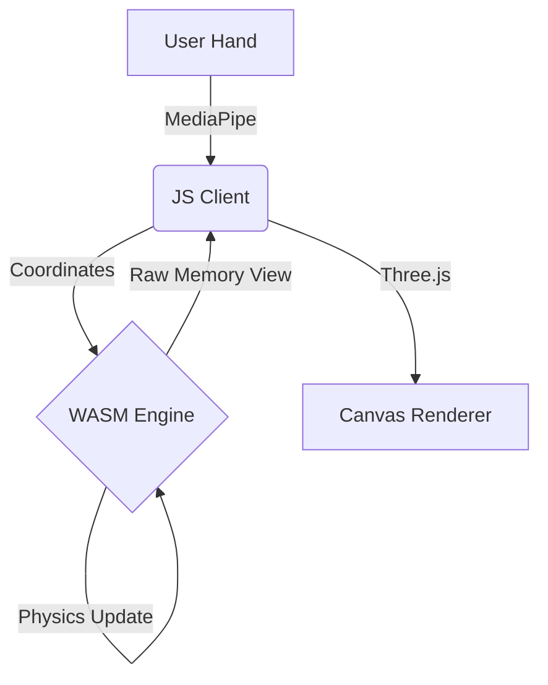

# 🌌 Quantum Flux: Particle Gravity Engine

  

> **"Experience the beauty of math and physics in your browser."**
>
> *⚠️ Source code is intentionally minimized and compiled. This repository focuses on the **demo and experience**, not raw implementation details.*
---

## 🚀 Overview

### ✨ Key Features

| Feature | Description |
| :--- | :--- |
| **⚡ WASM Physics** | Core attraction and swarming logic runs in raw **WebAssembly** for maximum FPS. |
| **✋ Hand Tracking** | Control the swarm with your **Index Finger** using MediaPipe. |
| **🤏 Gestures** | **Pinch** to trigger a cosmic color explosion. |
| **🪐 Shape Shifting** | Morph particles into Hearts, Planets, Flowers, and Fireworks. |
| **🔒 Security** | Heavily obfuscated client and opaque binary logic. |

---

## 🎮 How to Play

1.  **Allow Camera Access**: The app needs to see your hand.
2.  **Point your Index Finger**: The swarm will orbit your fingertip.
3.  **Pinch (Index + Thumb)**: Watch the particles surge with energy and change color!
4.  **Use UI Buttons**: Switch between formation modes (Heart, Saturn, etc.).

---

## 🛠️ Architecture

---

## 👤 Author

**Yogender**  
*   [Connect on LinkedIn](https://www.linkedin.com/in/yogender1/)

---

  <h2>🌟 Support My Work!</h2>
  
If you enjoy this project, please star the repository! It helps a lot!

  

  <i>Created with ❤️ by Yogender</i>

