# 🌌 **QUANTUM FLUX** 🌌
### *Particle Gravity Engine*

 

 

 

> [!CAUTION]
> **⚠️ SOURCE CODE NOTICE**  
> *The source code in this repository is intentionally minimized and compiled.*  
> *This repository focuses on the **demo and experience**, not raw implementation details.*

---

## 🚀 **Experience The Magic**

Quantum Flux is not just a simulation; it's an **interactive art piece**. It combines the raw performance of **Rust & WebAssembly** with the beauty of **Three.js** to create 8,000+ particles that react to your physical presence.

### ✨ **Key Features**

| Feature | Description |
| :--- | :--- |
| **⚡ Hyper-Fast Physics** | swarming logic runs in **WASM** for smooth 60fps+ performance. |
| **✋ AI Hand Tracking** | Control the universe with your **Index Finger**. |
| **🤏 Cosmic Pinch** | **Pinch** to trigger a supernova of colors. |
| **🪐 Shape Shifting** | Morph particles into Planets, Hearts, and Fireworks. |

---

## 🎮 **How to Play**

1.  **🚀 [Click Here to Launch](https://particle-gravity-fun.pages.dev/)**
2.  **📸 Allow Camera Access**: So the AI can see your hand.
3.  **👆 Point your Index Finger**: Become the center of gravity.
4.  **🤏 Pinch (Index + Thumb)**: Unleash chaotic energy!

---

## 🛠️ **Under The Hood**

```mermaid
graph LR
    A[🎥 Camera Input] -->|MediaPipe AI| B(👆 Hand Coordinates);
    B -->|JS Bridge| C{🦀 Rust WASM Engine};
    C -->|Physics Calculations| C;
    C -->|Float32Array| D[🎨 Three.js Renderer];
    D -->|WebGL| E[🖥️ Your Screen];
    style C fill:#dea,stroke:#333,stroke-width:2px
    style D fill:#aec,stroke:#333,stroke-width:2px
```

---

## 👤 **Connect With The Creator**

 
 

### 🌟 **Enjoyed the experience?** 
**Please star this repository to support future projects!**

 

<i>Created with ❤️ and ☕ by Yogender</i>

